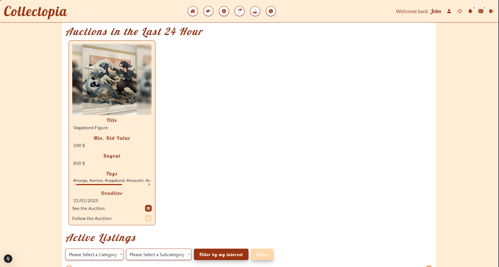
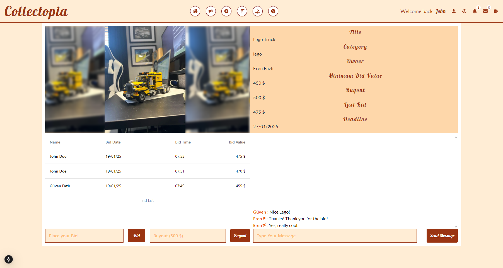
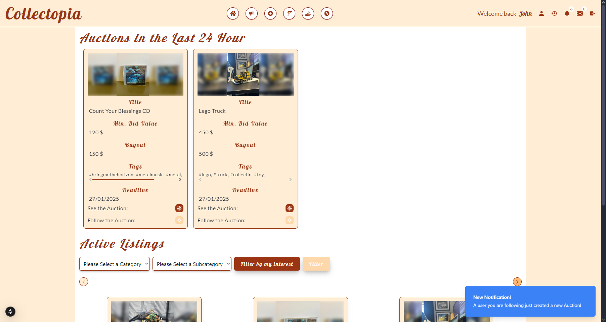

# Collectopia

**Collectopia** is a dynamic platform that allows users to auction their collectible items, participate in live bidding, and trade items with others. It combines real-time interaction, social engagement, and secure trading to create a seamless experience for collectors and enthusiasts alike.

Built with a modern tech stack—React, Next.js, Node.js, and MongoDB—Collectopia ensures performance, scalability, and an engaging user experience.

## Features

### Auction Management
- **Create Auctions**: Users can list their collectibles, set a deadline, and create auctions.
- **Bid System**: Participate in real-time bidding for listed items.
- **Image Upload**: Upload up to 3 images per item with smooth carousel viewing powered by ShadCN components.

### Social Interaction
- **Follow System**: Follow other users to stay updated on their new auctions and listed items.
- **Real-Time Chat**: Communicate with other users directly on auction pages or through private messages.

### Notification and Event Tracking
- **Notification System**: Receive notifications about bids, new auctions, trade offers, and more.
- **Event Tracker**: Log and review your actions, such as followed auctions, placed bids, and trade interactions.

### Trade System
- **Offer Trades**: Propose trades by selecting items from your inventory and offering them for items from another user's collection.
- **Trade Management**: Accept or decline trade offers and communicate to finalize trades directly.

## Key Systems

### Real-Time Communication
- **Socket.IO Integration**: Enables instant updates for chats, bids, notifications, and trades without page reloads.

### Authentication and Security
- **Session Management**: Secured with Express Session for reliable user authentication.
- **Input Validation**: Ensures secure and valid data submissions.

### Event Logging
- A detailed event tracker allows users to view their complete history of actions, such as bids, trades, and notifications.

## Technologies

### Frontend
- **React.js**: Core framework for building a responsive user interface.
- **Next.js**: Optimized rendering for improved performance and SEO.
- **TypeScript**: Ensures type safety and better development experience.
- **Tailwind CSS**: Modern and flexible styling.
- **Day.js**: Simplifies date and time management.
- **ShadCN Components**: Provides beautiful, reusable UI components.

### Backend
- **Node.js & Express.js**: Backend logic and API routes.
- **MongoDB & Mongoose**: Flexible database and schema management.
- **Socket.IO**: Real-time communication.
- **Express Session**: Session-based authentication.

## Optimized User Experience
- **Responsive Design**: Fully responsive across all devices for seamless usability.
- **Intuitive Navigation**: Clean and user-friendly interfaces for auctions, chats, notifications, and trades.

## Clean Code Practices
- **Reusable Components**: Modular design for scalability and maintainability.
- **Validation**: Ensures data integrity and security for all API interactions.

## App Preview

### Login Page

### Register Page

### Homepage  
- Explore auctions created in the last 24 hours and browse the complete auction list.

Last Auctions

HomePage

Filtered Auctions

### Auction Page
- Browse auctions, view item details, and place bids.

Listing Creation

Listing Creation Settings

Auction Page

### Add Item Page  
- Upload up to 3 images per item with preview functionality.  
- Add tags and organize items using category and subcategory systems.

Adding Item to Inventory

### Inbox  
- View messages with distinct styling for read and unread messages.  
- Open messages to read and respond directly.

Inbox

Message Dialog

Response Dialog

Message Sent Notification

### User Profiles  
- View a user's inventory and active listings with filter options.  
- Send messages, follow users, and send trade offers directly from their profile.

Inventory

Inventory Cards Expanded

Inventory Filtered

Active Listings

Senging Message

### Trade Offers
- Create, view, and manage trade offers.

Send Offers

Received Offers

Sent Offers

### Notifications
- Stay updated with actions from followed users or active auctions.

### Event List  
- Review your actions, such as bids, messages, and followed auctions.  
- Navigate directly to related auctions or profiles with a single click.  

Event List

### Receiving Live Notifications with Sockets

---

With a focus on real-time interaction, secure trading, and social engagement, **Collectopia** is the ultimate platform for collectors to showcase, auction, and trade their prized possessions.
